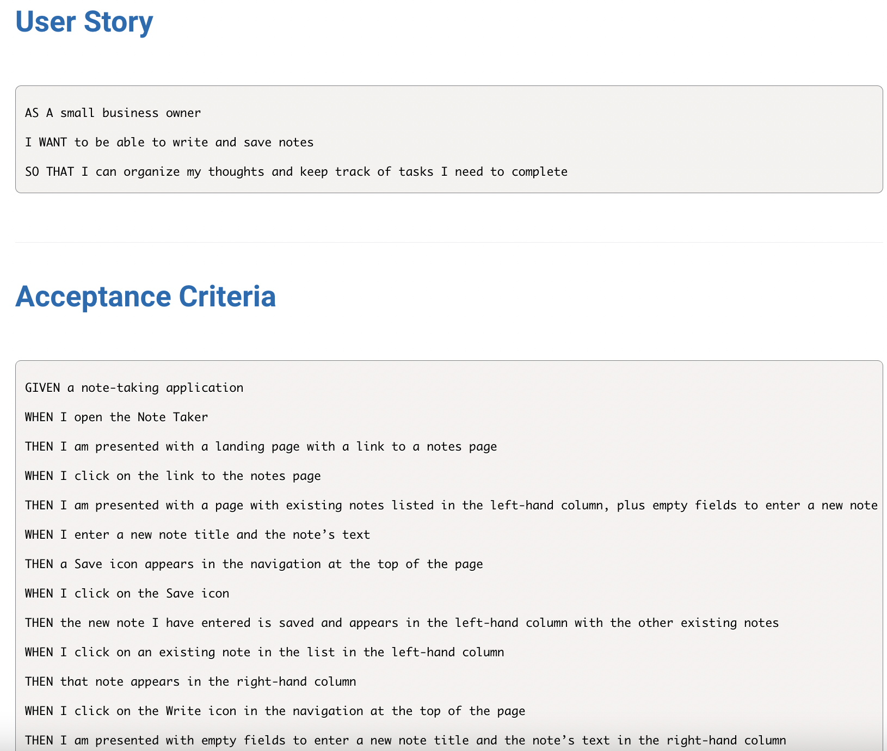

# Note Taker 

_by Latravia Gordon_ 

## Description

A full stack application called Note Taker that can be used to write and save notes. This application will use an Express.js back end and will save and retrieve note data from a JSON file.   This application is deployed on [Heroku](https://aqueous-everglades-46355.herokuapp.com/).

## Table of Contents

- [Requirements](#requirements)
- [Installation](#installation)
- [Usage](#usage)
- [Screenshot](#screenshot)
- [Tests](#tests)
- [Questions](#questions)
- [License](#license)

# Requirements

## Installation

The user should clone the repository, then run `npm init -y`, `npm i`, `npm install express`, `npm install uniqid`.

# Usage

<!-- [Video Demo]() -->

# Screenshot

## Tests

## Questions

For any questions about the project, please contact me by either of the following links:

- Email = gordonlc18@gmail.com
  or visit my GitHub profile:
- GitHub - [gordonlc18](https://github.com/gordonlc18)

## License

This project is licensed under the MIT license.
